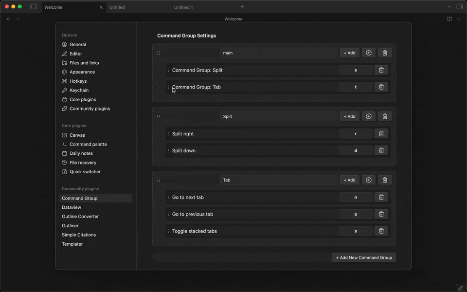
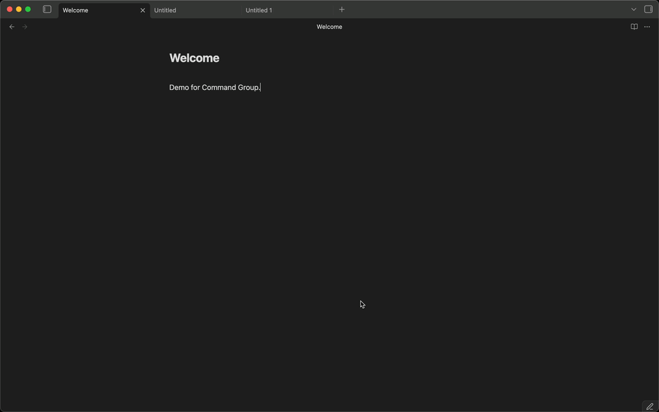

# Obsidian Command Group

 

Group commands and select them quickly with custom keyboard shortcuts.

## ✨️Features

- Create command groups to execute multiple commands.
- Drag and drop commands to reorder them.
- Drag and drop groups to reorder them.

- [Vim-style key notation](#️key-notation-guide) for sequence keys.

## 🛠️Usage

1. Enable community plugins in settings.
2. Install via [BRAT](https://github.com/TfTHacker/obsidian42-brat) (Recommended).
3. Open Command Group settings tab.
4. Create a new group or edit an existing group.
5. Add commands to the group.

## ⌨️Key Notation Guide

### 📌Basic Notation

Command Group uses Vim-style key notation for sequence keys. You can use:

- **Single characters**: `a-z`, `0-9` (case-insensitive for lowercase)
- **Uppercase letters**: `A` or `<S-a>` (both formats work for Shift+a)
- **Special keys**: `<Space>`, `<Tab>`, `<F1>`, etc.
- **Modifiers**: `C` (Ctrl), `S` (Shift), `A` (Alt), `M` (Meta/Cmd/Win)

### ⚡️Modifier Keys

| Modifier | Meaning | Example |
|----------|---------|---------|
| `C` | Ctrl | `<C-n>` = Ctrl+n |
| `S` | Shift | `<S-a>` = Shift+a |
| `A` | Alt | `<A-x>` = Alt+x |
| `M` | Meta | `<M-s>` = Cmd/Win+s |

You can combine multiple modifiers: `<C-S-x>` = Ctrl+Shift+x

### 💎Special Keys

| Notation | Key | Notation | Key |
|----------|-----|----------|-----|
| `<Space>` | Space | `<Tab>` | Tab |
| `<BS>` or `<Backspace>` | Backspace | `<Del>` or `<Delete>` | Delete |
| `<Home>` | Home | `<End>` | End |
| `<PageUp>` | Page Up | `<PageDown>` | Page Down |
| `<F1>` - `<F12>` | Function keys | | |

### 📝Examples

| Input | Meaning | Use Case |
|-------|---------|----------|
| `j` | Just press 'j' | Simple single-key trigger |
| `A` | Shift+a (uppercase A) | Capital letter |
| `<S-a>` | Shift+a (Vim-style) | Same as above |
| `<C-n>` | Ctrl+n | Common shortcut style |
| `<C-S-x>` | Ctrl+Shift+x | Multi-modifier combination |
| `<Space>` | Spacebar | Spacebar trigger |
| `<F1>` | F1 key | Function key |
| `<M-c>` | Meta/Cmd/Win+c | Platform-specific Meta key |

### 🚫Reserved Keys

The following keys are reserved for modal navigation and cannot be used as sequence keys:

- Arrow keys (`ArrowUp`, `ArrowDown`, `ArrowLeft`, `ArrowRight`)
- `Enter` / `Escape`

These keys are needed to navigate and close the command selection modal.

### 💡FAQ

**Q: What's the difference between `A` and `<S-a>`?**
A: Both work identically and produce Shift+a. Use whichever feels more natural.

**Q: Can I use lowercase in angle brackets like `<c-a>`?**
A: Yes! Modifier letters are case-insensitive, so `<c-a>` and `<C-a>` both work.

**Q: Why doesn't my incomplete key like `<c` work?**
A: The validation now runs when you leave the field (on blur), so you can type incomplete sequences. Just make sure the final sequence is complete and valid.

**Q: Can I use special characters like `@` or `#`?**
A: Yes, most single characters work as-is. Some may need angle bracket notation depending on your keyboard layout.

**Q: How do I set a hotkey for the entire group?**
A: Click the **Configure Hotkey** button (🔑) in the group header, which opens Obsidian's hotkey settings pre-filtered to your group.

**Q: What happens if I use a duplicate key in the same group?**
A: The plugin will show an error and prevent saving duplicate keys within the same group. Each sequence key must be unique within its group.
